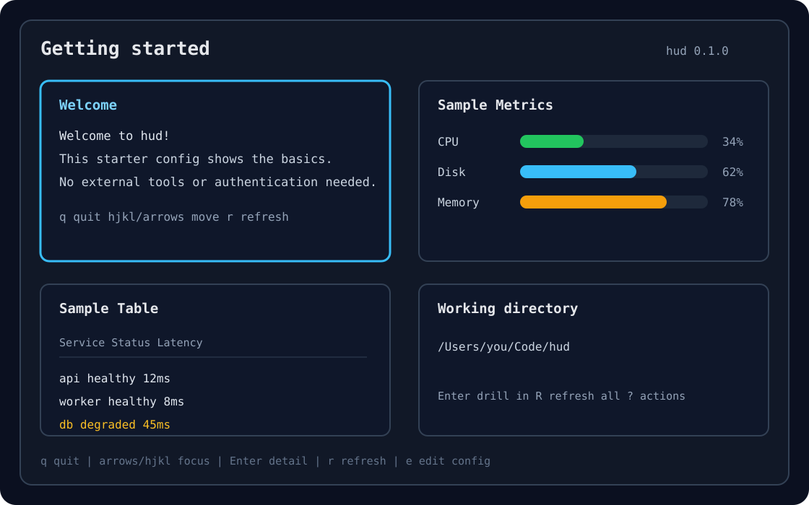

# hud

A programmable terminal cockpit for getting oriented, finding the next thing that needs attention, and jumping into action from the keyboard.



`hud` turns a small TOML file into a local terminal dashboard. Each panel runs a shell command, renders the result, and gives you keyboard-first ways to refresh, inspect, and launch follow-up actions.

## What It Is

- A single-user local TUI for command-backed dashboards.
- A lightweight way to collect `task`, `gh`, `tmux`, scripts, and status checks in one place.
- A static-config tool: edit TOML, run `hud`, iterate.
- Manual refresh first: no background polling or plugin daemons in V1.

## What It Is Not

- Not a plugin host or remote agent runner.
- Not a web dashboard.
- Not a process supervisor for long-running jobs.
- Not a multi-user service.

## Install

Download the latest archive for your platform from GitHub Releases, unpack it, and put `hud` somewhere on your `PATH`.

```sh
tar -xzf hud-aarch64-apple-darwin.tar.gz
sudo install -m 0755 hud-aarch64-apple-darwin/hud /usr/local/bin/hud
hud --version
```

Release artifacts are built for:

- `x86_64-unknown-linux-gnu`
- `x86_64-apple-darwin`
- `aarch64-apple-darwin`

Install from source when developing or testing unreleased changes:

```sh
cargo install --git git@github.com:tnezdev/hud.git
```

## 60-Second Demo

Run the built-in demo:

```sh
hud --demo
```

Or run the starter config from a checkout:

```sh
cargo run -- --config examples/starter.toml
```

Validate a config without opening the TUI:

```sh
hud --config examples/starter.toml --check-config
```

## Configuration

By default, `hud` reads:

```text
$XDG_CONFIG_HOME/.hud/config.toml
```

If `XDG_CONFIG_HOME` is unset, the fallback is:

```text
$HOME/.config/.hud/config.toml
```

Use a specific file with:

```sh
hud --config ./examples/starter.toml
```

Minimal config:

```toml
title = "Work cockpit"
default_timeout_secs = 120

[[panels]]
id = "tasks"
title = "Tasks"
command = "task mine"
timeout_secs = 10

[panels.row_detail]
title = "Task detail"
command = "task {{ID}}"

[[panels.actions]]
key = "t"
label = "Open tasks"
command = "taskwarrior-tui"
```

Config fields:

- `title`: dashboard title.
- `default_timeout_secs`: optional command timeout, default `120`.
- `[[panels]]`: one command-backed panel.
- `panels.id`: unique panel id.
- `panels.title`: panel title.
- `panels.command`: shell command used to refresh the panel.
- `panels.output`: optional output protocol: `text`, `table-json`, or `metrics-json`; default `text`.
- `panels.timeout_secs`: optional panel timeout override.
- `[panels.row_detail]`: optional selected-row drill-in command for `table-json` panels.
- `panels.row_detail.title`: row detail view title.
- `panels.row_detail.command`: shell command with `{{Column Name}}` placeholders from the selected row.
- `[[panels.actions]]`: optional fire-and-forget action for the focused panel.
- `panels.actions.key`: single-character keyboard shortcut.
- `panels.actions.label`: footer label.
- `panels.actions.command`: shell command launched without waiting for completion.

## Output Protocols

Plain text stdout is the default panel content protocol.

Use `output = "table-json"` for typed table rendering:

```json
{
  "type": "table",
  "columns": ["Repo", "State"],
  "rows": [["hud", "active"]]
}
```

Use `output = "metrics-json"` for aggregate line gauges:

```json
{
  "type": "metrics",
  "metrics": [
    { "label": "Budget", "value": 72, "max": 100 }
  ]
}
```

Metrics use Unicode block characters by default. If your terminal font renders those poorly, set `HUD_ASCII_BARS=1` to use ASCII bars.

Malformed structured output, non-zero exits, timeouts, and launch failures render as panel error states instead of crashing the dashboard.

## Row Drill-In And Actions

Press `Enter` on a dashboard card to open the panel detail view. For `table-json` panels, configure `[panels.row_detail]` to run a command for the selected row:

```toml
[[panels]]
id = "services"
title = "Services"
command = "./scripts/services-json"
output = "table-json"

[panels.row_detail]
title = "Service Detail"
command = "./scripts/service-detail '{{Service}}'"
```

Focused-panel actions are fire-and-forget commands. They appear in the footer and in the `?` overlay:

```toml
[[panels.actions]]
key = "e"
label = "edit config"
command = "${EDITOR:-vi} ~/.config/.hud/config.toml"
```

## Keybindings

- `q`, `Esc`, or `Ctrl-C`: quit.
- `h`/`j`/`k`/`l` or arrow keys: move focus through the card grid.
- `Tab` / `Shift-Tab`: cycle focus through panels.
- `Enter`: drill into the focused panel.
- In detail view, `Enter`: open configured row detail for the selected row.
- `?`: toggle help/actions overlay.
- `q`, `x`, or `Esc`: step back from detail views.
- `q`, `x`, `Esc`, or `?`: close help/actions overlay.
- In detail view, `j`/down and `k`/up select output rows; scrolling follows selection.
- `r`: refresh focused panel.
- `R`: refresh all panels.
- Focused-panel action keys are shown in the footer.

## Examples

- `examples/starter.toml`: safe first-run config with no external tool dependencies.
- `examples/kitchen-sink.toml`: static showcase for text, metrics, tables, row drill-in, and actions.
- `examples/dogfood.toml`: local working cockpit for tools like `tmux`, `gh`, and `task`.

Run an example from a checkout:

```sh
cargo run -- --config examples/kitchen-sink.toml
```

## tmux Popup

One-off popup:

```sh
tmux display-popup -E -w 90% -h 80% 'hud'
```

With a local config during development:

```sh
tmux display-popup -E -w 90% -h 80% 'cd /path/to/hud && cargo run -- --config examples/dogfood.toml'
```

Example keybinding:

```tmux
bind-key H display-popup -E -w 90% -h 80% 'hud'
```

The dashboard is most comfortable at roughly 100 columns by 30 rows or larger. Quit returns control cleanly to tmux because `hud` restores the terminal alternate screen on exit.

## Development

Run locally:

```sh
cargo run
```

Run the normal quality gate:

```sh
./scripts/check
```

Run the separate dependency advisory gate when release/security posture matters:

```sh
./scripts/audit
```

Release notes and tag steps live in `docs/release.md`.

## License

MIT
